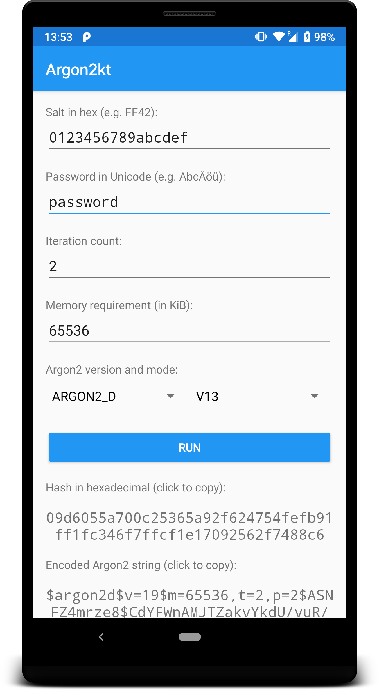

# Argon2Kt: An Android/Kotlin binding for the Argon2 hash

Argon2Kt is a binding for the [Argon2 password hash](https://github.com/P-H-C/phc-winner-argon2) that allows to use it
easily and securely on Android.

It uses JNI to bridge JVM/C and allows relying solely on direct-allocated ByteBuffers (see below). Naturally, it comes with an extensive test coverage and a sample app.

Argon2Kt is licensed under the MIT license. See the [LICENSE file](https://github.com/lambdapioneer/argon2kt/blob/master/LICENSE) in the root directory.


## Quick start 👩‍💻 👨‍💻

Add the dependency to your gradle.build file:

```groovy
implementation 'com.lambdapioneer.argon2kt:argon2kt:0.1'
```

Use the `Argon2Kt` class to hash and verify using Argon2:

```kotlin
// initialize Argon2Kt and load the native library
val argon2Kt = Argon2Kt()

// hash a password
val hashResult : Argon2KtResult = argon2Kt.hash(
  mode = Argon2Mode.ARGON2_I,
  password = passwordByteArray,
  salt = saltByteArray,
  tCostInIterations = 5,
  mCostInKibibyte = 65536
)

println("Raw hash: ${hashResult.rawHashAsHexadecimal()}")
println("Encoded string: ${hashResult.encodedOutputAsString()}")

// verify a password against an encoded string representation
val verificationResult : Boolean = argon2Kt.verify(
  mode = Argon2Mode.ARGON2_I,
  encodedString = hashResult.encodedOutputAsString()
  password = passwordByteArray,
)
```


## FAQ 🤔

**How do I reduce the exposure of secrets in memory?**

Internally, Argon2Kt uses direct-allocated ByteBuffers for passing around both secrets (e.g. password, hash), and outputs (e.g. raw hash).

In contrast to ByteArrays and Strings, direct-allocated ByteBuffers (usually) reside outside the JVM heap and maintain a fixed position. This allows easy passing between native libraries through the JVM world. For our purposes, it allows us to overwrite the content with confidence once we no longer need them. Therefore, using them is preferable.

Argon2Kt offers convenience methods to use ByteArrays and Strings instead. However, the JVM might move these in memory without overwriting the old location. Therefore, you can no longer make sure that the secrets are removed once they are no longer needed.

**Can I use Argon2Kt in Java?**

Of course. Checkout the [`SampleJavaClass.java`](https://github.com/lambdapioneer/argon2kt/blob/master/app/src/main/java/com/lambdapioneer/argon2kt/app/SampleJavaClass.java#L13-L19) source file for an example. Note that it is not included in the sample app APK although it compiles just fine.

**I have problems with an UnsatisfiedLinkError in production. What can I do?**

By default Argon2Kt uses the system's loader for .so files. However, for some models and configurations it is known to fail. You can use an alternative SoLoader such as [ReLinker](https://github.com/KeepSafe/ReLinker) using the callback provided by the `Argon2Kt` constructor.


## Contribute 👋

When contributing, please follow the following (common-sense) steps:

 - Create an issue before you write any code. This allows to guide you in the right direction.
    - If you are after a 1-5 line fix, you might ignore this.
 - In the pull-request explain the high-level goal and your approach. That provides valuable context.
 - Convince others (and yourself) that the change is safe and sound.
    - Run `./gradlew connectedAndroidTest` and manually test the APK in release configuration using `./gradlew installDebug`.


## Sample app 📱

The repository comes with a sample app that you can install both in debug and release configuration. Just run `./gradlew installDebug` or `./gradlew installRelease` respectively.


